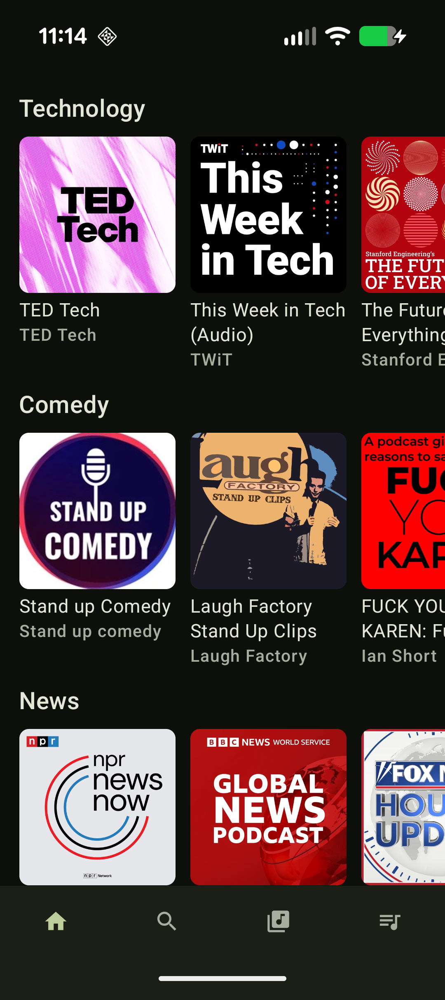
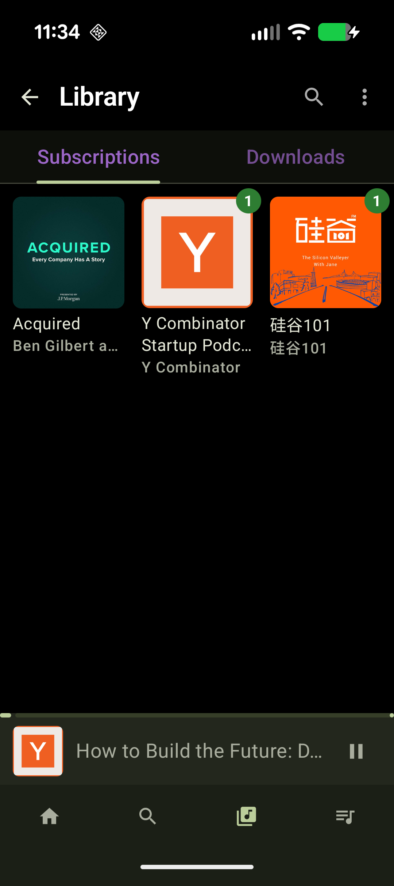
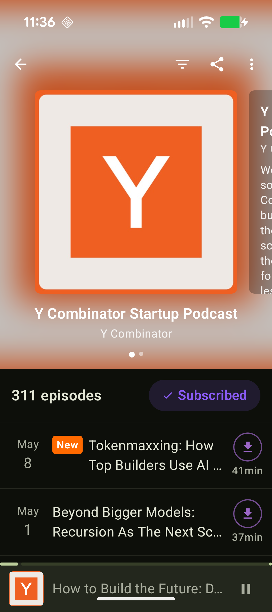
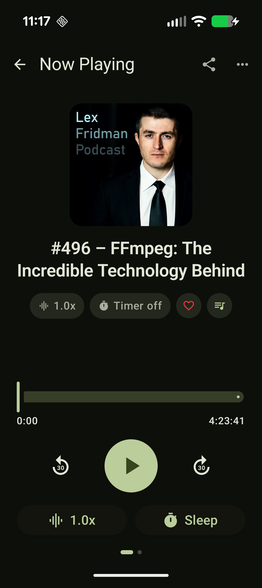
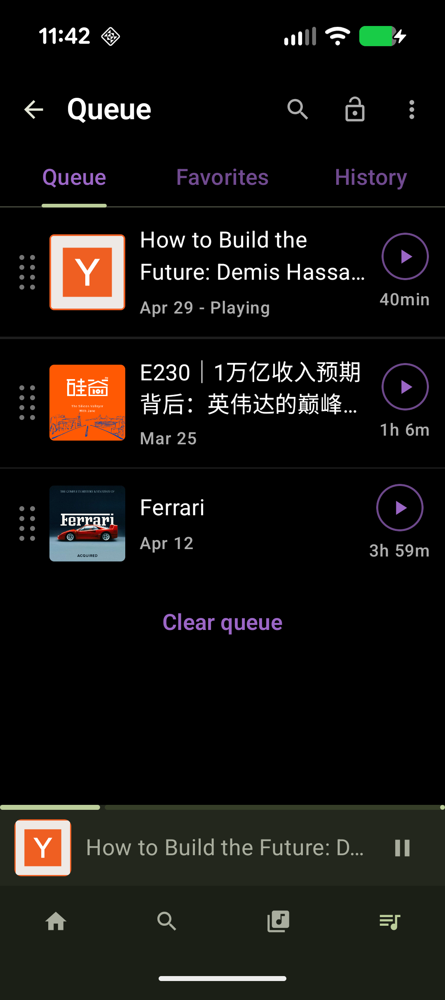

# MyPodcast

A modern Android podcast player, built from scratch with Jetpack Compose, Media3, and a clean-architecture core. It's a reference app for modern Android: Compose-only UI, Navigation 3, Hilt DI, Room persistence, Retrofit + RSS, and a foreground MediaSessionService for proper background playback.

## Download

Grab the latest signed APK from the **[Releases page](https://github.com/ocpinkpig/MyPodcast/releases/latest)**, or download directly:

- [MyPodcast-v1.0.2.apk](https://github.com/ocpinkpig/MyPodcast/releases/download/v1.0.2/MyPodcast-v1.0.2.apk) — Android 8.0+ (API 26+)

### Install

1. On your Android device, open the APK link above (or transfer the file via USB / cloud).
2. When prompted, allow your browser or file manager to **install unknown apps** for this one install.
3. Open the APK and tap **Install**.

> The APK is self-signed for sideloading and is not distributed via Google Play. If you ever switch to a Play-distributed build, you'll need to uninstall this version first.

## Features

<table>
<tr>
<td width="60%" valign="top">

### Discover & search
- **Featured podcasts** on the Home tab via the iTunes Search API.
- **Search** podcasts by name and open a detail page with the show's RSS-parsed episode list.
- **Subscribe / unsubscribe** to add a show to the Library.
- A **mini player** stays docked above the bottom nav while you browse.

</td>
<td width="40%" valign="top" align="center">

</td>
</tr>
<tr>
<td width="60%" valign="top">

### Library
- **Subscriptions** tab with cover art and per-show new-episode badges.
- **Pull-to-refresh** to re-fetch RSS feeds for all subscriptions.
- **Downloads** tab listing offline episodes.
- Tabs are swipeable and styled to match the app's purple Material 3 theme.

</td>
<td width="40%" valign="top" align="center">

</td>
</tr>
<tr>
<td width="60%" valign="top">

### Episodes
- Full episode metadata from RSS (title, description, duration, publish date, artwork).
- **Favorite** episodes from the player or detail screen.
- **Download** for offline listening (per-episode download button).
- **Share** an episode or a show via the system share sheet.
- "NEW" badges that clear automatically after one minute of playback.

</td>
<td width="40%" valign="top" align="center">

</td>
</tr>
<tr>
<td width="60%" valign="top">

### Playback
- Background playback through a `MediaSessionService` (`PlaybackService`).
- **Mini player** docked above the bottom nav, expanding to a full Now Playing screen.
- **Variable playback speed**, scrubbing, and 30-second skip.
- **Sleep timer** (`SleepTimerManager`).
- **Lockscreen / notification controls**: media-style notification with episode artwork, podcast title as subtitle, play/pause, and 30s rewind / fast-forward custom actions. Tapping the notification reopens the app.

</td>
<td width="40%" valign="top" align="center">

</td>
</tr>
<tr>
<td width="60%" valign="top">

### Play queue
- Add episodes to a queue from anywhere; queue is **persisted in Room** and rehydrated on launch.
- **Queue tab** with three sub-tabs: **Queue / Favorites / History**, swipeable between them.
- **Drag-to-reorder** queue items, **swipe-to-remove** with confirmation.
- The system "next" command (lockscreen, headset, Bluetooth) advances through the in-app queue via a `QueueAwarePlayer` wrapper.
- History records every episode you play; favorites are kept across reinstalls of the same subscription.

</td>
<td width="40%" valign="top" align="center">

</td>
</tr>
</table>

## Tech stack

| Area | Choice |
|---|---|
| Build | AGP 9.0.1, Kotlin 2.3.20, KSP 2.3.7 (standalone), JDK 17, `compileSdk` 36, `minSdk` 26 |
| UI | Jetpack Compose, Material 3, Material Icons Extended, Coil 3 |
| Navigation | Jetpack Navigation 3 (`androidx.navigation3`) |
| DI | Hilt 2.59.2 |
| Persistence | Room 2.7.1 (subscriptions, episodes, downloads, queue) |
| Networking | Retrofit 2.11 + Gson, OkHttp logging, custom `XmlPullParser` RSS parser |
| Media | Media3 1.5.1 (ExoPlayer + MediaSession + UI) |
| Misc | `sh.calvin.reorderable` for drag-to-reorder lists |

## Architecture

Standard Clean Architecture, three layers under `com.example.mypodcast`:

```
data/
  local/      Room entities, DAOs, AppDatabase, DatabaseModule
  remote/     Retrofit iTunes API + RSS parser
  repository/ PodcastRepositoryImpl, EpisodeRepositoryImpl,
              LibraryRepositoryImpl, PlayerRepositoryImpl
domain/
  model/      Podcast, Episode, PlayerState, DownloadState
  repository/ Repository interfaces
  usecase/    Search, GetFeatured, GetPodcastDetail, GetEpisodes,
              Download, Subscribe, GetLibrary, PlayEpisode, ...
media/        PlayerController (Singleton ExoPlayer),
              QueueAwarePlayer, SleepTimerManager, PlaybackService
ui/           home, search, detail, library, queue, player, main, components
di/           DatabaseModule, NetworkModule, RepositoryModule
```

Navigation is keyed by 5 `NavKey` types: `HomeNavKey`, `SearchNavKey`, `LibraryNavKey`, `PodcastDetailNavKey(podcastId)`, `PlayerNavKey(episodeGuid)`. `MainScreen` provides the scaffold with bottom nav and the `MiniPlayer`.

## Getting started

Requirements:
- Android Studio (Ladybug or newer recommended)
- JDK 17
- An emulator or device on **API 26+**

Build and install a debug APK:

```bash
./gradlew :app:installDebug
```

Run unit tests (Robolectric + Media3 test utils are wired up):

```bash
./gradlew :app:testDebugUnitTest
```

The iTunes Search API (`https://itunes.apple.com/`) requires no key. On Android 13+ the app requests `POST_NOTIFICATIONS` at runtime so that the media-style notification can appear.

## Project layout

```
app/                   Application module
docs/superpowers/      Design docs and implementation plans
gradle/libs.versions.toml   Version catalog
```

## Status

Active hobby project — all features above are implemented and on `main`. Most recent work has been on Queue UX and lockscreen media controls. There is no release build configured yet (`isMinifyEnabled = false`); R8 / proguard tuning is a future task.

## License

See [LICENSE](LICENSE).
